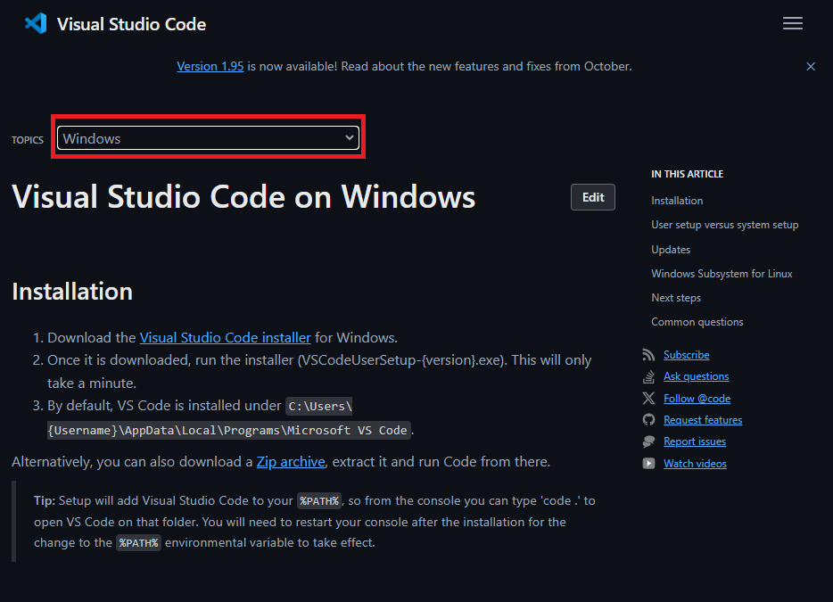
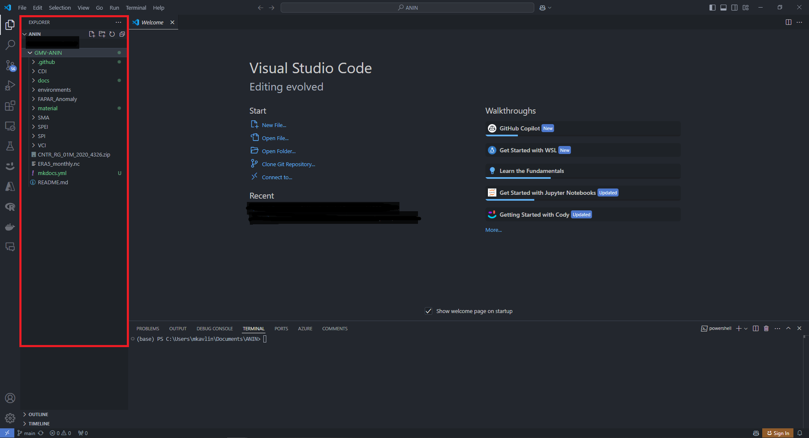

# Installation

## Requirements
To run the Drought Indices tools, a recent version of Anaconda3 needs to be installed on your system—first visit [Python.org](https://www.python.org/){:target="_blank"} to confirm the latest version number.

You can check the version of Python you have installed by pressing `Win + R`, type `cmd`, and press `Enter` to open Command Prompt then running the command below. 
```
python --version
```
Please ensure that version 3.8 or higher is installed before proceeding. 

## Installing Python
Install Python by downloading an installer appropriate to your system from [python.org](https://www.python.org/){:target="_blank"}  and running it.

!!! Note ""

    Be sure to check the box to have Python added to your PATH.

    

## Installing Anaconda
Install Anaconda by following the steps detailed here: [anaconda.com](https://docs.anaconda.com/anaconda/install/windows/){:target="_blank"}.

!!! Note ""

    Be sure to check the box to have Anaconda3 added to your PATH environment variable.

    

## Installing Git on Windows
1. Navigate to the latest [Git for Windows installer ](https://gitforwindows.org/){:target="_blank"} and download the latest version.
2. Follow the instructions as provided in the Git Setup wizard screen until the installation is complete. When prompted, select use standard Git Windows Command Prompt.
3. Verify that Git was properly installed by running the following in `Command Prompt`.
   
```
 git version
``` 

!!! tip "Other Operating Systems"
    If you are running other operating systems such as macOS, Linux, Ubuntu, etc, please follow the installation steps:

    For Python visit: [Download Python for Other Platforms ](https://wiki.python.org/moin/BeginnersGuide/Download){:target="_blank"}

    For Git visit: [Install Git for Other Platforms](https://github.com/git-guides/install-git){:target="_blank"}

## Installing VSCode on Windows
Follow the intstructions detailed in the installation section of this site: [VSCode Setup](https://code.visualstudio.com/docs/setup/windows)

!!! tip "Select the Right Operating System"
    

## Clone the ANIN-Drought-Indices repository
1. Create a folder where you wish to work, for example "C:\Users\user\Documents\ANIN".
2. Next, open VSCode. In the Welcome tab select "*Open Folder...*" and naviage to the folder you created in Step 1.
3. You should now see a Explorer tab with the folder appearing in it.
4. We recommend installing the VSCode Jupyter exetension. You can access the extensions by going to "*View*>*Extensions*". Then searching in the SearchBar for "*Jupyter*".
5. In VSCode open a Terminal. You can do this by clicking on "*Terminal*>*New Terminal*" on the upper tool bar.
6. Finally, clone the github repository by running the following code in your terminal:
```
git clone https://github.com/ANIN-Drought-Monitoring/GMV-ANIN.git
```

All the files in the ANIN Drought Indices repository will be cloned to your local machine in your specified working folder. You can easily verify that in Windows Explorer, or directly in the Explorer tab in VSCode.

!!! Note ""
    

## Create a Virtual Environment with Conda

In Command Prompt, change the directory again to point to the newly created `GMV-ANIN` folder on your PC using the following prompt:
``` 
cd GMV-ANIN
```
Next, create a 'virtual environment' with the necessary libraries for the ANIN-Drought-Monitoring tool. This will help avoid any conflicts with different library versions you may already have in your machine.
You can do this by executing the following command in the terminal:

``` 
conda env create -f GMV-ANIN\environments\SPI-SPEI_environment.yml
```

Once the virtual environment is created, we can activate it.
``` 
conda activate anin
```
!!! tip
    You will need to activate the virtual environment each time you restart your VSCode session. When the virtual environment is activated, you will see (anin) in front of the directory. To deactivate your environment you just need to run:
    ```
    conda deactivate
    ```

Now that all the installations are complete, we can start running the different drought indices tools.
